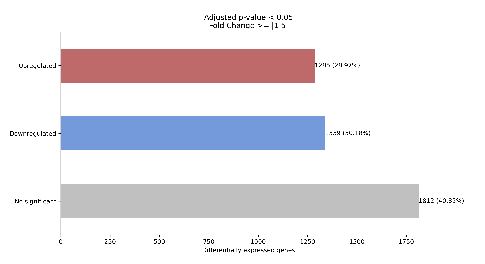

# dgeapy: Differential Gene Expression Analysis in Python

`dgeapy.py` is a Python toolkit for analyzing RNAseq data, focusing on differential gene expression and intersections among datasets.

## Installation

### Setting up the Environment

Create a dedicated environment for dgeapy using Conda:

```shell
conda create --name dgeapy python=3.10
conda activate dgeapy
```

### Installing Dependencies

Install all necessary libraries with Conda:

```shell
conda install pandas numpy openpyxl matplotlib seaborn matplotlib-venn UpSetPlot
```

#### Dependencies and their Roles

- [pandas](<https://pypi.org/project/pandas/>): For dataframe analysis and manipulation.
- [numpy](<https://pypi.org/project/numpy/>): Numerical computing tasks.
- [openpyxl](<https://pypi.org/project/openpyxl/>): Reading and writing Excel xlsx files.
- [matplotlib](<https://pypi.org/project/matplotlib/>): Data visualization.
- [seaborn](<https://pypi.org/project/seaborn/>): High-level manipulation of figures.
- [matplotlib-venn](<https://pypi.org/project/matplotlib-venn/>): Venn diagrams.
- [UpSetPlot](<https://pypi.org/project/UpSetPlot/>): UpSet plots.

## Usage

Available scripts are:

- [dgeapy.py analyze](#dgeapy-analyze) 
- [dgeapy.py intersect](#dgeapy-intersect)

```
python dgeapy/dgeapy.py -h

Differential Gene Expression Analyisis in Python at different levels.

Usage: python dgeapy.py <COMMAND> [OPTIONS]

Commands:
    analyze           Perform differential gene expression analyisis
    intersect         Find intersections between indexes of multiple files

Options:
    -h, --help        Show this help message and exit
    -V, --version     Show version number and exit

Examples:
    python dgeapy.py analyze -h
    python dgeapy.py analyze <mygenes.csv> -f 2.0 -p 0.01
    python dgeapy.py intersect -f mutA.csv -f mutB.csv -n "Mutant A" -n "Mutant B" -i gene_id
```

### dgeapy analyze

Determine the differentially expressed genes from a dataframe.

```
$ python dgeapy/dgeapy.py analyze -h
usage: dgeapy.py analyze <TABLE> [OPTIONS]

Differential Gene Expression Analysis.
Generates tables with differentially expressed plots to visualize the results.


positional arguments:
  <TABLE>                  Path to the gene expression data file (CSV, TSV, XLSX).

options:
  -h, --help               show this help message and exit
  -o, --output DIR         Specify the output directory (default: cwd).
  -p, --padj FLOAT         Adjusted p-value threshold for significance (default: 0.05).
  -f, --fold-change FLOAT  Fold change threshold for significance (default: 1.5).
  -F, --formats [STR]      Output formats for plots (e.g. svg, pdf) (default: ['png']).
  -e, --exclude [STR]      Exclude indexes matching specified patterns.
  -N, --nan-values [STR]   Strings to recognize as NaN (default: ['', '--']).
  -k, --keep-duplicated    Keep duplicated indexes (default: False).
  -I, --index-column STR   Column name for index (default: index).
  -L, --log2fc-column STR  Column name for log2 Fold Change (default: log2_fold_change).
  -P, --p-column STR       Column name for adjusted p-values (default: padj).
```

Script workflow:

1. Input a table in CSV, TSV, or XLSX format.
2. Verify and clean the data by checking for NaN values, duplicated values in the index, and excluding indexes with specific patterns using `--exclude`.
3. Utilize `--index-column` to index each row and add fold change and regulation columns.
4. **Identify differentially expressed genes (DEG)** by applying thresholds for p-adjusted value (`--padj`) and fold change absolute value (`--fc`).
5. Output three tables (DEGs, upregulated and downregulated) and two figures (a bar plot and a volcano plot).

#### Usage example:

```shell
python dgeapy/dgeapy.py analyze example/data/dgeapy_dgea_example.xlsx -o example/analyze_output -L log2FoldChange -N NA
```

Output tables and figures can be found in `example/analyze_output`.




Example data can be downloaded from [GSE206442](<https://www.ncbi.nlm.nih.gov/geo/download/?acc=GSE206442&format=file&file=GSE206442%5FGIBERT%5F01%5Fnew%5Fannot%5Fwo%5Foutlier%5FSTAT%5Fvs%5FLOG%5Fresults%2Exlsx>).

### dgeapy intersect

Compute intersections of indexes among a list of dataframes.

```
$ python dgeapy/dgeapy.py intersect -h
usage: dgeapy.py intersections -f <file1> -f <file2> [...] -n <name1> -n <name2> [...] [OPTIONS]

Computes intersections between multiple data files and generates comprehensive intersection
tables and visualizations.


options:
  -h, --help              show this help message and exit
  -o, --output DIR        Specify the output directory for results (default: cwd).
  -i, --index-column STR  Name of the index column in the data files (default: index).
  -F, --formats [STR]     Output formats for the plots (e.g. svg) (default: ['png', 'pdf']).
  -N, --nan-values [STR]  Strings to recognize as NaN (default: ['', '--', 'NA']).
  -e, --exclude [STR]     Exclude indexes matching specified patterns.

required arguments:
  -f, --files [<FILE>]    Paths to the data files for intersection analysis.
  -n, --names [STR]       Names for the data files to label plots and tables.
```

Script workflow:

1. Input multiple dataframes along with their assigned names.
2. Validate and prepare data by checking for NaN, null, or duplicated values in the indexes and exclude specific patterns using `--exclude`.
3. **Compute all possible intersections between the indexes of the provided dataframes.**
4. Generate TSV and XLSX files for each non-empty intersection to document results.
5. Produce visual representations of intersections: automatically generate a weighted and unweighted Venn Diagram for up to three dataframes, or an UpSet Plot for larger sets to visualize the present and missing intersections.

#### Usage example:

Intersection analysis between 3 files:

```shell
python dgeapy/dgeapy.py intersect -f example/data/condition1.xlsx -f example/data/condition2.xlsx -f example/data/condition3.xlsx -n "Condition 1" -n "Condition 2" -n "Condition 3" -o example/intersect3_output
```
Results can be found in `example/intersect3_output`

Example of a generated Venn Diagram: 


Intersection analysis between 4 files:

```shell
python dgeapy/dgeapy.py intersect -f example/data/condition1.xlsx -f example/data/condition2.xlsx -f example/data/condition3.xlsx -f example/data/condition5.xlsx -n "Condition 1" -n "Condition 2" -n "Condition 3" -n "Condition 4" -o example/intersect4_output
```

Results can be found in `example/intersect4_output`

Example of a generated UpSet Plot:


