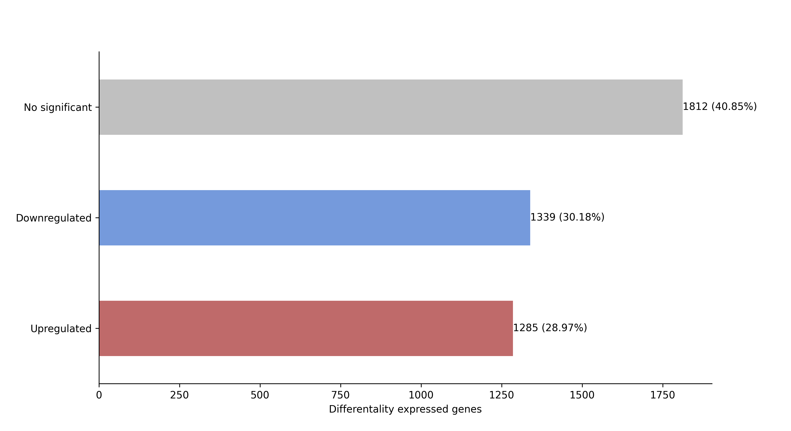
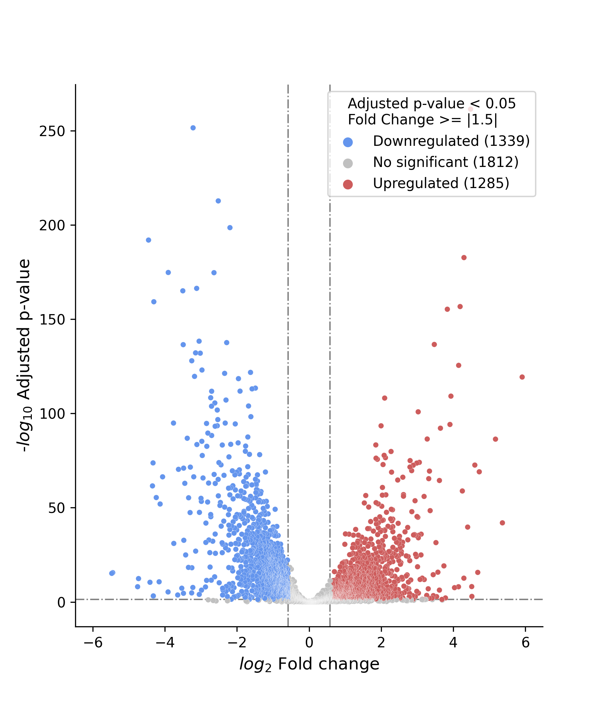

# dgeapy: Differential Gene Expression Analysis in Python

dgeapy.py is a set of tools that try to analyze RNAseq data at different levels.

Available scripts are:

- [dgeapy.py dgea](#dgeapy-dgea) 
- [dgeapy.py intersections](#dgeapy_intersections)

## Dependencies

Python (>= 3.9)

```shell
conda create --name dgeapy python=3.9
```

- Data analysis:
    - [pandas](<https://pypi.org/project/pandas/>): dataframe analysis and
      manipulation
    - [numpy](<https://pypi.org/project/numpy/>): computing
    - [openpyxl](<https://pypi.org/project/openpyxl/>): engine for reading/writting xlsx files
- Data visualization:
    - [matplotlib](<https://pypi.org/project/matplotlib/>): low level manipulations
    - [seaborn](<https://pypi.org/project/seaborn/>): high level manipulations
    - [matplotlib-venn)[]: Venn Diagram drawing
    - [UpSetPlot](): UpSet Plot generation drawing

```shell
pip install pandas numpy openpyxl matplotlib seaborn matplotlib-venn UpSetPlot
```
## Usage

```
./dgeapy.py -h

dgeapy: Differential Gene Expression Analyisis in Python at different levels.

usage: dgeapy.py <command> [options]

    dgea            differential gene expression analyisis
    intersections   find intersections between the indexes of n files

    options:
        -h, --help
```

### dgeapy dgea

Determine the differentially expressed genes from a dataframe.

1. Takes a table in CSV, TSV or XLSX format as input.
2. Checks for any NaN values in index, p-adjusted and log2 fold change columns.
3. Indexes each row of the table according to `--index-colum`. 
4. Checks for duplicated values in index.
5. Excludes indexes that contain specific patterns provided with the `--exclude` arg.
6. Adds fold change and regulation columns.
7. **Determines the differentially expressed genes** (DEG). A gene is considered as DEG when it's p-adjusted value is less than the provided threshold in `--padj` and it's fold change absoulte value is equal or greater than the provided threshold in `--fc`.
8. Creates an output directory `-o` where it stores a table containing the DEG `deg.table`, a table containing only the upregulated genes `upregulated.table` and another table containing the downregulated genes `downregulated.table` in both TSV and XLSX formats.
9. Creates a `fig` directory inside the output directory containing a generated bar plot (Fig. 1)
   and volcano plot (Fig. 2).

```
./dgeapy.py dgea -h
usage: dgeapy.py dgea TABLE [options]

Perform Differential Gene Expression Analysis (DGEA) by determining the differentially expressed
genes from a dataframe. It takes as input a table in CSV, TSV, or XLSX format containing gene
expression data. The script applies thresholds for adjusted p-values and fold changes to
identify significant gene expression changes. Generates bar plots and volcano plots to visualize
the results. The output includes the modified dataframe with added columns for fold change and
gene regulation, as well as the generated plots saved in the specified output directory.

positional arguments:
  TABLE                 path to the CSV, TSV or XLSX file

optional arguments:
  -h, --help            show this help message and exit
  -o STR, -output-directory STR
                        output directory [Default: $CWD/dgeapy_output]
  --padj FLOAT          adjusted p-value threshold. LESS THAN THRESHOLD WILL BE APPLIED [Default: 0.05]
  --fc FLOAT            fold change threshold. ABSOLUTE VALUE EQUAL OR MORE THAN THRESHOLD WILL BE APPLIED [Default: 1.5]
  --formats STR       plot formats [Default: ['png']]
  --exclude STR       string pattern to match against indexes. Matched indexes are excluded
  --nan-values STR    strings to recognize as NaN values. Transcripts with NaN padj or NaN fold change will be excluded [Default: ["", "--"]]
  --keep-duplicated     if passed, keep duplicate index values [Default: False]
  --index-column STR    name of the column that will be used as index [Default: index]
  --log2fc-column STR   name of the column containing the log2 Fold Change values [Default: log2_fold_change]
  --padj-column STR     name of the column containing the p-adjusted values [Default: padj]
```

#### Usage example:

```shell
./dgeapy/dgeapy.py dgea example/data/dgeapy_dgea_example.xlsx -o example/dgeapy_output --log2fc-column log2FoldChange --nan-values NA
```

Output tables and figures can be found in `example/dgeapy_output`.





Example data can be downloaded at [GSE206442](<https://www.ncbi.nlm.nih.gov/geo/download/?acc=GSE206442&format=file&file=GSE206442%5FGIBERT%5F01%5Fnew%5Fannot%5Fwo%5Foutlier%5FSTAT%5Fvs%5FLOG%5Fresults%2Exlsx>).

### dgeapy intersections

Compute intersections of indexes among a list of dataframes.

1. Takes multiple dataframes and their assigned name.
2. Checks for any NaN values, null values or duplicaded values in the indexes.
3. Excludes indexes that contain specific patterns provided with the `--exclude` argv.
4. **Computes all of the possible intersections between the indexes of the provided dataframes.**
5. Generates a TSV and a XLSX file for each non-empty intersection.
6. Generates a weighted and an unweighted Venn Diagram if the n of provided
   tables is 3 or less.
7. Generates an UpSet Plot for a better visualitzation of the present and
   missing intersections.

```
./dgeapy/dgeapy.py intersections -h
usage: dgeapy.py intersections <file1> <file2> <file3> ... name_1 name_2 name_3 ... [options]

Given a list of data files, compute all the possible intersections between them.
Then, generate two tables (TSV and XLSX) for each intersection. If the number of 
data files is less than or equal to 3, generate Venn diagrams and an UpSet plot.
If the number of data files is greater than 3, generate only an UpSet plot.

optional arguments:
  -h, --help            show this help message and exit
  -f <file_1> <file_2> ... [<file_1> <file_2> ... ...], --files <file_1> <file_2> ... [<file_1> <file_2> ... ...]
                        data files to be processed
  -n <name_1> <name_2> ... [<name_1> <name_2> ... ...], --names <name_1> <name_2> ... [<name_1> <name_2> ... ...]
                        names of the data files that will be used in the plots and tables
  -o PATH, --output_directory PATH
                        output directory [Default: $CWD/dgeapy_intersections_output]
  -i STR, --index_column STR
                        name of the index column
  --formats STR [STR ...]
                        output formats for the plots [Default: ['png', 'pdf']]
  --nan-values STR [STR ...]
                        strings to recognize as NaN values in index column Default: ['', '--', 'NA']
  --exclude STR [STR ...]
                        string patterns to exclude from the index column
```

#### Usage example:

Intersection analysis between 3 files:

```shell
./dgeapy/dgeapy.py intersections -f test/dgeapy_intersections_test/data/set1-20.xlsx test/dgeapy_intersections_test/data/set4-23.xlsx test/dgeapy_intersections_test/data/set7-26.xlsx -n set-1-20 set-4-23 set-7-26 -o test/dgeapy_intersections_test/3_sets_test
```
Results can be found in `test/dgeapy_intersections_test/3_sets_test`

Example of a generated Venn Diagram: 


Intersection analysis between 4 files:

Results can be found in `test/dgeapy_intersections_test/4_sets_test`

Example of a generated UpSet Plot:


```shell
./dgeapy/dgeapy.py intersections -f test/dgeapy_intersections_test/data/set1-20.xlsx test/dgeapy_intersections_test/data/set4-23.xlsx test/dgeapy_intersections_test/data/set7-26.xlsx test/dgeapy_intersections_test/data/set16-35.xlsx -n set-1-20 set-4-23 set-7-26 set-16-35 -o test/dgeapy_intersections_test/4_sets_test
```
